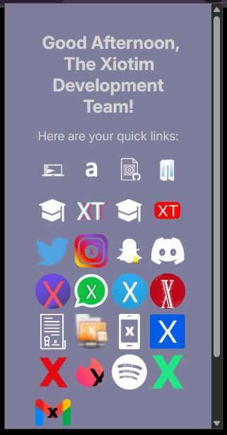
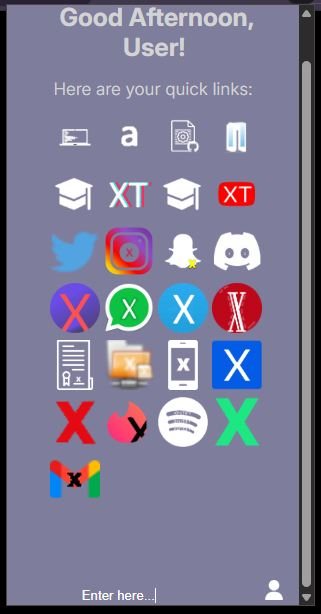

# xLinks

A launcher of Xiotim Links leading up to the last repository.

The assets can be found, on imgur! So click the links in the code.

## Acknowledgements

- Huge shout-out to my youngest project as of writing this: [XInterest](https://github.com/l-xdt/xinterest/) & [this project](https://github.com/l-xdt/xLinks/)

- A huge help in this project: [DiffChecker](https://www.diffchecker.com)

## Authors

- [LeidenSchaft-Xiotim Development Team](https://www.github.com/l-xdt/)

- [Alvin Maranx, II ツ (Avun)](https://github.com/avunii/)

## Features

Well, it's a launcher! No PS, just a launcher.

## Screenshots

**PS:** You can change your name!

## Run Locally

**Here!**

## Roadmap

- Open your Xiotim Links, just uses the GitHub icon..

- **Written in HTML, CSS, JSON and some questionable JavaScript**

## Support

For support, reach out to us via either of our emails: [this one](mailto:trowesigames@gmail.com) or [this one](mailto:leidenschaft.tech@hotmail.com) or join our Discord server: which is not up as of writing this.

## Feedback

This still applies to feedback aswell, Whether you want to give us positive words, or negative ones, send away. (but please only send constructive critisism).

Send away: [here](mailto:trowesigames@gmail.com) or [here](mailto:leidenschaft.tech@hotmail.com).

## FAQ

**Only one question..**

#### Can I modify this to fit my needs?

Yeah! That is why we make these repositories for. For you! To tinker and to try new things (but use the unpacked please).

## Used By

This project is used by the following companies:

- LeidenSchaft-Xiotim Accquistions (Limited).

- XDT-Studium.

- Xiotim Development Team [Limited] (XDT).

- XDT-noHesi.

## Related

Here are some related projects:

- [XioTok](https://github.com/l-xdt/xiotok/)

- [noHesi](https://github.com/l-xdt/no-hesi/)

- [Xirox](https://github.com/l-xdt/xirox/)

- [Studium](https://github.com/l-xdt/studium/)

- [XioTim](https://github.com/l-xdt/xiotim/)

- [XioTube](https://github.com/l-xdt/xiotube/)

- [xSocial](https://github.com/l-xdt/xSocial/)

- [XGram](https://github.com/l-xdt/xgram/)

- [XChat](https://github.com/l-xdt/xchat/)

- [XCord](https://github.com/l-xdt/xcord/)

- [XApp](https://github.com/l-xdt/xapp/)

- [Xelegram](https://github.com/l-xdt/xelegram/)

- [XInterest](https://github.com/l-xdt/xInterest/)

- [XLinks](https://github.com/l-xdt/xLinks/)

## Documentation

- Coming soon! Hopefully!

## API Reference

Nope, no APIs except Google ones. If there are I wil update this.
